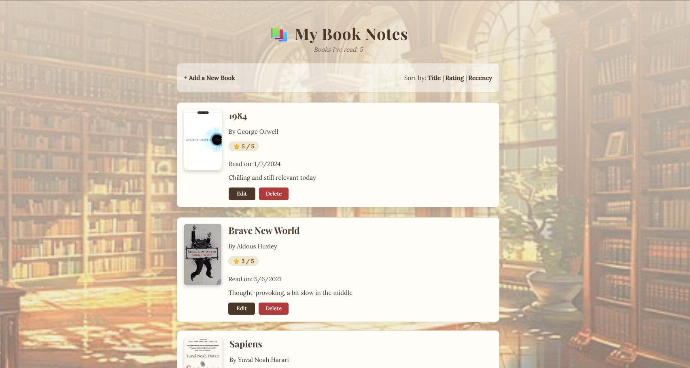

# 📚 Book Notes

A web app to track books I've read — inspired by [Derek Sivers' book notes page](https://sive.rs/book). Built as a capstone project for The Complete Web Development Bootcamp.

## Features

- Add, edit, and delete books you've read, along with your notes and rating
- Automatically fetches book cover images using the Open Library Covers API
- Sort your books by title, rating, or how recently you read them
- Data is permanently stored in a PostgreSQL database

## Built With

- **Node.js** & **Express** – server and routing
- **PostgreSQL** & **pg** – database and database connection
- **EJS** – HTML templating
- **Axios** – fetching book covers from the Open Library API
- **dotenv** – keeping database credentials out of the codebase

## Getting Started

### Prerequisites

- [Node.js](https://nodejs.org/) installed
- [PostgreSQL](https://www.postgresql.org/) installed and running

### Setup

1. Clone this repository:
```bash
   git clone https://github.com/H-J-Codes/book-notes.git
   cd book-notes
```

2. Install dependencies:
```bash
   npm install
```

3. Create your database:
```bash
   psql -U postgres -c "CREATE DATABASE booknotes;"
```

4. Create the `books` table:
```bash
   psql -U postgres -d booknotes -f schema.sql
```

5. Create a `.env` file in the project root (use `.env.example` as a template) and fill in your own database credentials:
DB_USER=postgres
DB_HOST=localhost
DB_NAME=booknotes
DB_PASSWORD=your_password_here
DB_PORT=5432


6. Start the server:
```bash
   node index.js
```

7. Open your browser to `http://localhost:3000`

## Database Schema

See `schema.sql` for the full table definition. Each book stores: title, author, ISBN, notes, rating (1–5), and date read.

## Screenshots



## Acknowledgements

- Idea inspired by [Derek Sivers](https://sive.rs/book)
- Book cover images provided by the [Open Library Covers API](https://openlibrary.org/dev/docs/api/covers)